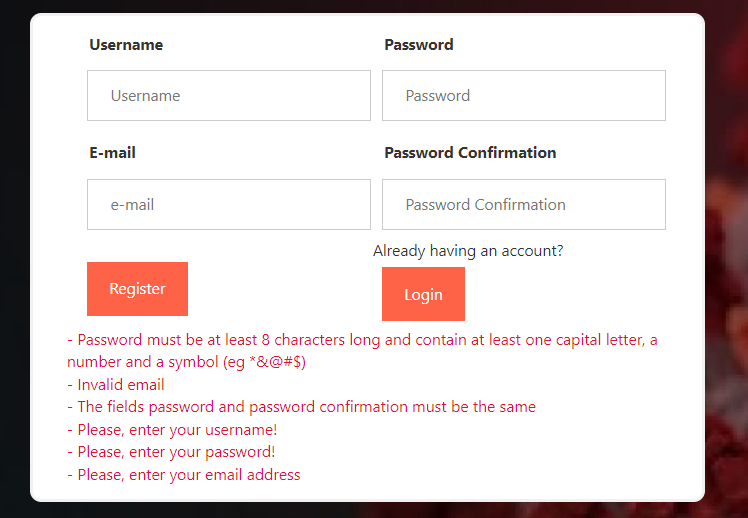
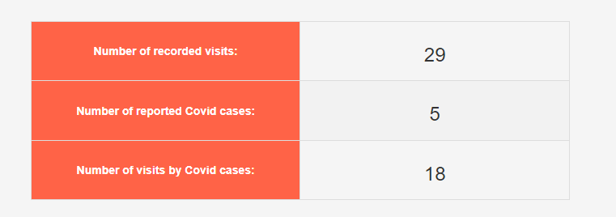
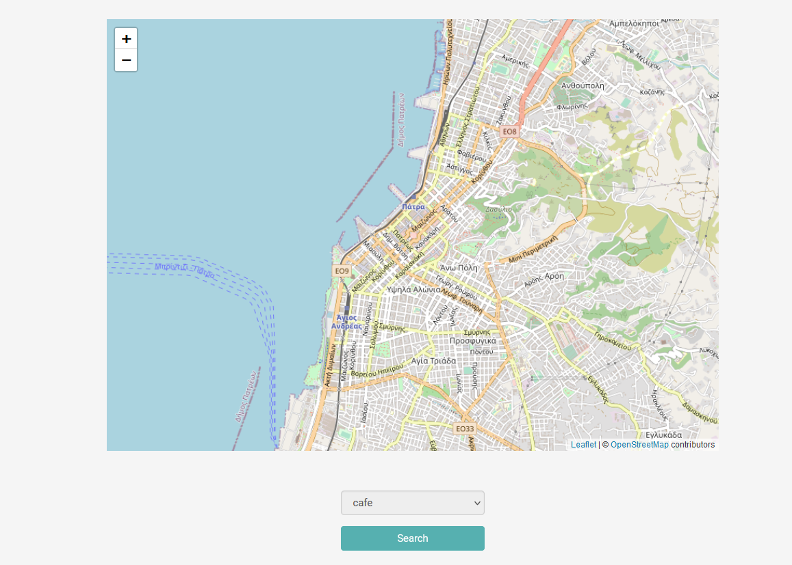
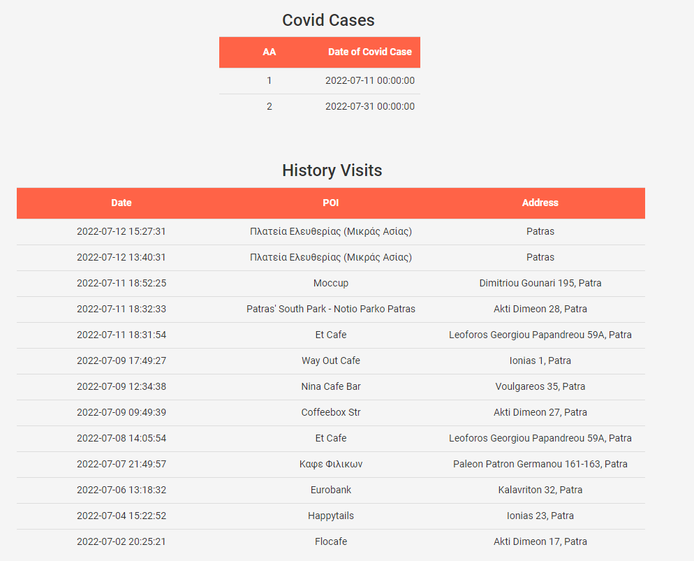
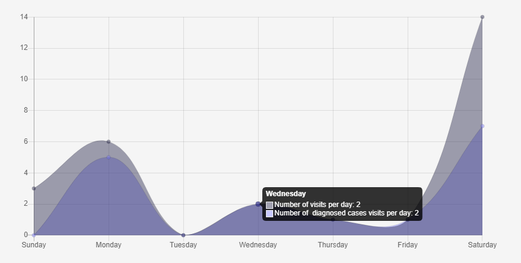
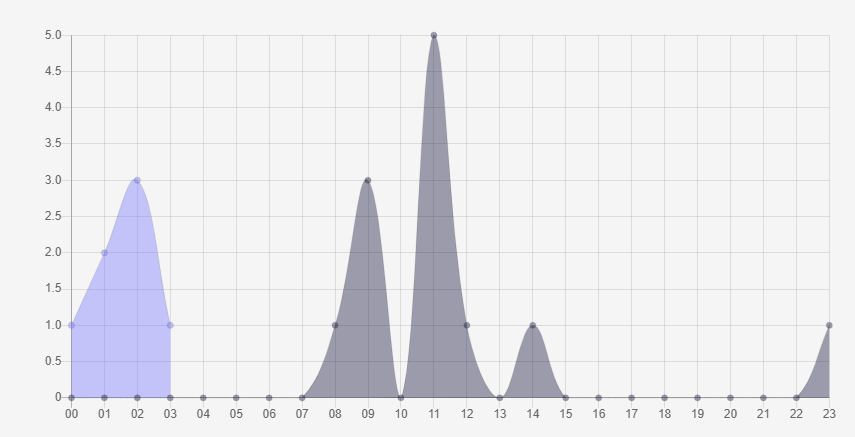
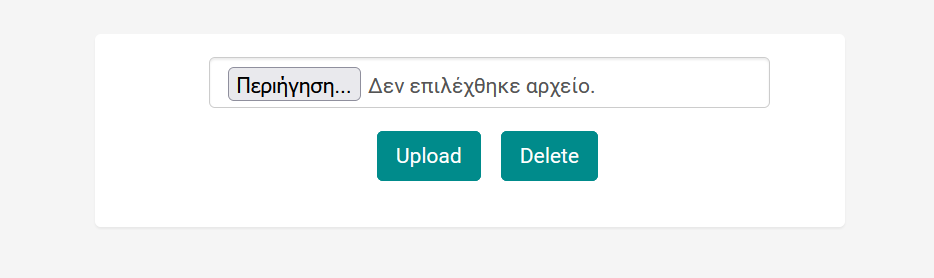
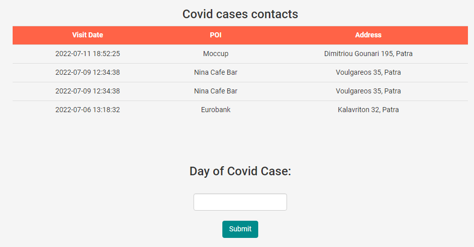
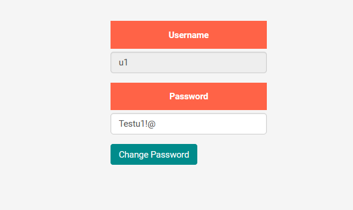
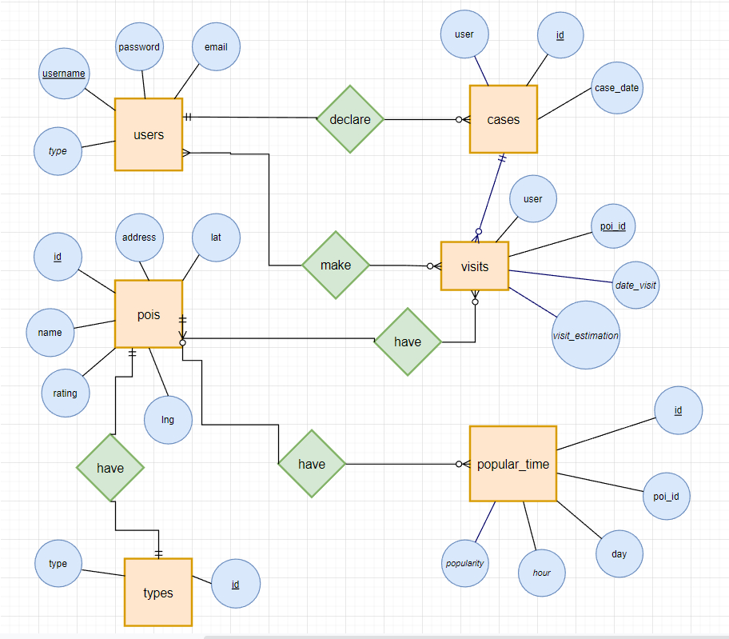

# Populating Visitability Data for Scatter Control

<p align="center">
  
</p>

<p align="center">
  <b>Web application for crowdsourced visitability data and COVID-19 spread monitoring.</b>
</p>

Ακαδημαϊκή web εφαρμογή για τη συλλογή πληθοποριστικών δεδομένων επισκεψιμότητας και την υποστήριξη ελέγχου της διασποράς COVID-19.

Το project δημιουργήθηκε στο πλαίσιο του μαθήματος **«Προγραμματισμός και Συστήματα στον Παγκόσμιο Ιστό»** του Τμήματος Μηχανικών Η/Υ και Πληροφορικής Πάτρας, κατά το ακαδημαϊκό έτος **2021–2022**.

---

## Περιγραφή

Το σύστημα επιτρέπει σε χρήστες να καταγράφουν επισκέψεις σε σημεία ενδιαφέροντος, να δηλώνουν ημερομηνίες στις οποίες διαγνώστηκαν με COVID-19 και να παρακολουθούν σχετικές πληροφορίες από το ιστορικό τους.

Παράλληλα, ο διαχειριστής έχει πρόσβαση σε συγκεντρωτικά στατιστικά, γραφήματα επισκέψεων και κρουσμάτων, καθώς και λειτουργίες διαχείρισης των δεδομένων του συστήματος.

## Κύριες λειτουργίες

### Επισκέπτης

- Δημιουργία νέου λογαριασμού μέσω φόρμας εγγραφής.
- Έλεγχος εγκυρότητας των στοιχείων εγγραφής.
- Σύνδεση στο σύστημα με username και password.

### Χρήστης

- Δήλωση ημερομηνίας κρούσματος COVID-19.
- Προβολή σημείων που είχε επισκεφθεί σε ημερομηνίες που σχετίζονται με δηλωμένα κρούσματα.
- Αναζήτηση σημείων ενδιαφέροντος πάνω σε χάρτη ανά τύπο δραστηριότητας, όπως café, restaurant και park.
- Καταγραφή επίσκεψης σε σημείο ενδιαφέροντος.
- Προβολή ιστορικού επισκέψεων και δηλωμένων κρουσμάτων.
- Αλλαγή κωδικού πρόσβασης με βάση τις προδιαγραφές εγκυρότητας του συστήματος.

### Διαχειριστής

- Προβολή συνολικού αριθμού καταγεγραμμένων επισκέψεων.
- Προβολή συνολικού αριθμού δηλωμένων κρουσμάτων COVID-19.
- Προβολή επισκέψεων που σχετίζονται με ημερομηνίες δηλωμένων κρουσμάτων.
- Ανάλυση επισκέψεων και κρουσμάτων ανά ημέρα.
- Ανάλυση επισκέψεων και κρουσμάτων ανά ώρα για επιλεγμένη ημέρα.
- Ανέβασμα δεδομένων μέσω της λειτουργίας `Upload`.
- Διαγραφή των δεδομένων της βάσης μέσω της λειτουργίας `Delete`.

---


## Preview

<table>
  <tr>
    <td align="center"><b>Registration</b></td>
    <td align="center"><b>Admin Statistics</b></td>
  </tr>
  <tr>
    <td></td>
    <td></td>
  </tr>
  <tr>
    <td align="center"><b>POI Map</b></td>
    <td align="center"><b>User History</b></td>
  </tr>
  <tr>
    <td></td>
    <td></td>
  </tr>
</table>

## Screenshots

### Αρχική σελίδα / Login


### Εγγραφή χρήστη


### Στατιστικά διαχειριστή


### Ανάλυση ανά ημέρα



### Ανάλυση ανά ώρα



### Διαχείριση δεδομένων



### Επαφές / επισκέψεις που σχετίζονται με κρούσματα



### Αναζήτηση σημείων ενδιαφέροντος στον χάρτη


### Ιστορικό χρήστη


### Αλλαγή κωδικού πρόσβασης



---

## Μοντέλο βάσης δεδομένων

Το ER διάγραμμα της εφαρμογής περιλαμβάνει τις βασικές οντότητες:

- `users`
- `cases`
- `visits`
- `pois`
- `types`
- `popular_time`

και τις μεταξύ τους συσχετίσεις για τη διαχείριση χρηστών, κρουσμάτων, επισκέψεων, σημείων ενδιαφέροντος και δεδομένων δημοφιλών ωρών.



---

## Περιβάλλον που καταγράφεται στην αναφορά

| Τεχνολογία | Έκδοση |
|---|---:|
| MySQL | 5.7.36 |
| PHP | 7.4.26 |
| Apache | 2.4.51 |
| WampServer | 3.2.6 |

### Ρυθμίσεις PHP

```ini
max_execution_time = 1500
max_input_type = 9000
max_input_vars = 2500
memory_limit = 900M
post_max_size = 2048M
upload_max_filesize = 2048M
```

### Ρύθμιση MySQL

```ini
max_allowed_packet = 5120M
```

> **Σημείωση:** Η αναφορά καταγράφει τις παραπάνω εκδόσεις και παραμέτρους, αλλά δεν περιγράφει αναλυτικά τα repository-specific βήματα εγκατάστασης, το όνομα του SQL dump ή την ακριβή τοπική διαδρομή εκτέλεσης. Αυτά μπορούν να προστεθούν όταν επιβεβαιωθούν από τα αρχεία του project.

---

## Δομή λειτουργίας

```text
Επισκέπτης
   │
   ├── Register
   └── Login
          │
          ├── Χρήστης
          │    ├── Δήλωση κρούσματος
          │    ├── Αναζήτηση POI
          │    ├── Καταγραφή επίσκεψης
          │    ├── History
          │    └── Change Password
          │
          └── Διαχειριστής
               ├── Statistics
               ├── Daily / Hourly Analysis
               ├── Upload
               └── Delete
```

---

## Ασφάλεια

Για λόγους ασφαλείας, πραγματικά passwords, access tokens, API keys ή άλλα credentials **δεν πρέπει να αποθηκεύονται στο repository ή στο README**.

Η αρχική αναφορά περιλαμβάνει δοκιμαστικά στοιχεία χρηστών. Τα passwords δεν έχουν αντιγραφεί σε αυτό το README.

---


## Repository structure

Το `README.md` πρέπει να βρίσκεται στη **ρίζα του repository** και τα screenshots παραμένουν στον φάκελο `report/images/`.

```text
WEB/
├── README.md
├── admin/
├── css/
├── js/
├── report/
│   ├── report.docx
│   ├── covid.sql
│   └── images/
│       ├── login.png
│       ├── register.png
│       ├── admin_statistics.png
│       ├── admin_daily_chart.png
│       ├── admin_hourly_chart.png
│       ├── admin_data_management.png
│       ├── covid_contacts.png
│       ├── poi_map.png
│       ├── user_history.png
│       ├── change_password.png
│       └── er_diagram.png
├── user/
├── check.php
├── connect.php
└── ...
```

## Ακαδημαϊκό πλαίσιο

- **Μάθημα:** Προγραμματισμός και Συστήματα στον Παγκόσμιο Ιστό
- **Θέμα:** Πληθοποριστικά δεδομένα επισκεψιμότητας για έλεγχο διασποράς COVID-19
- **Ακαδημαϊκό έτος:** 2021–2022

